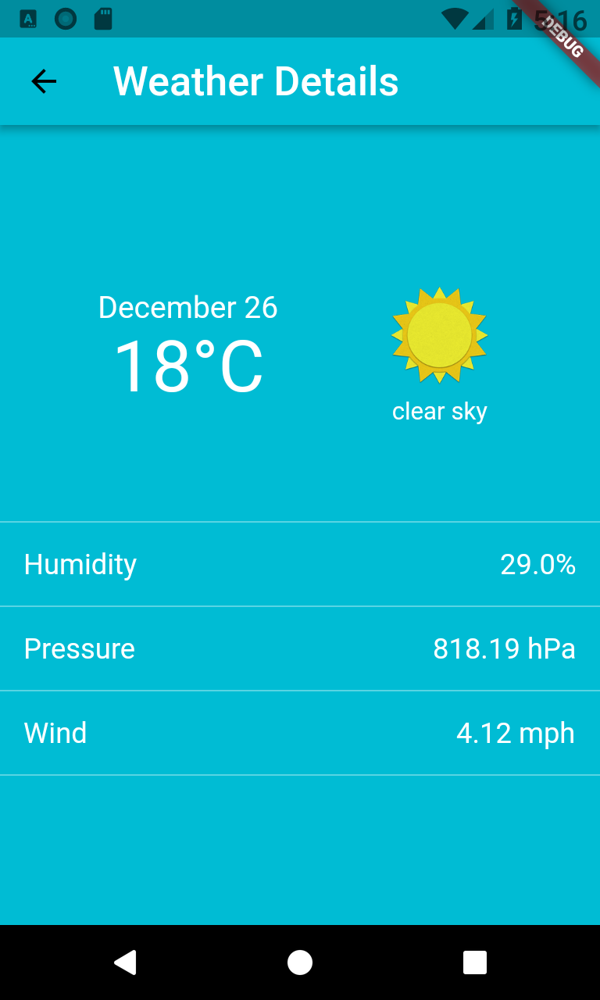

# Flutter Weather Forecast

## Screenshots




"Weather Forecast" is an Flutter mobile app that displays the current weather and the 5-day forecast information.

## Features

  * Display the weather information based on the location selected by the user which can be a location name or a geolocation (latitude/longitude).
  * Users can select any given day from the list to see the details.
  * Server data is cached for faster loading and have the information available offline.
  * Refresh page to reload the data from the server.

## Getting started

*Open Weather Map* API Key is required.
In order for the Weather Forecast app to function properly, an API key for openweathermap.org must be included.

Make sure to include the unique key to lib/api/service.dart
```dart
static final String _apiKey = "<set-your-own-api-key>";
```

For help getting started with Flutter, view the official documentation online
[documentation](https://flutter.io/).

## License
The content of this repository is licensed under a [Apache License, Version 2.0](http://www.apache.org/licenses/LICENSE-2.0)
